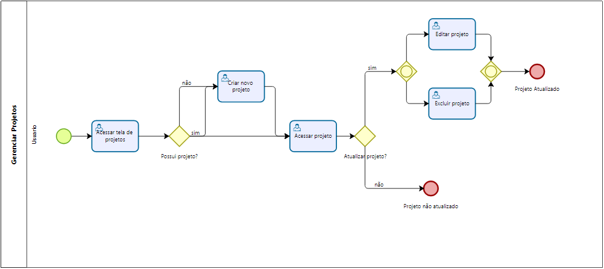

### 3.3.2 Processo 2 – Gerenciar projeto

O processo de gerenciamento de projeto começa assim que o usuário acessa a tela de projetos. O usuário poderá acessar seus projetos (se já tiver algum) ou criar um novo projeto.

#### Detalhamento das atividades

* **Acessar tela de projetos:**
    Assim que o usuário acessar tela projetos, sera possível ver quais os projetos que pertence ao usuário e também a opção de criar um novo projeto.

* **Acessar projeto:**
    Se o usuário ja tiver algum projeto cadastro, será possível abrir o detalhamento do projeto, onde terá todas as informações referentes ao projeto.

* **Criar novo projeto:**
    se o usuário escolher criar um novo projeto, ele sera redirecionado para a tela de criação, onde ele informará todos os detalhes do projeto, como nome, descrição e as ferramentas que serão utilizadas.

* **Excluir projeto:**
    assim que o usuário abrir o detalhamento do projeto, ele tera uma opção de excluir o projeto.

* **Editar projeto:**
    assim que o usuário abrir o detalhamento do projeto, ele tera uma opção de editar as informações do projeto.

**Acessar projeto**

**Acessar pagina de projetos**

| **Campo** | **Tipo** | **Restrições** | **Valor default** |
| --------- | -------- | -------------- | ----------------- |
| Projetos  | cards    |                |                   |

| **Comandos** | **Destino**                      | **Tipo** |
| ------------ | -------------------------------- | -------- |
| Criar        | início processo de criar projeto | edit     |

**Criar projeto**

| **Campo**       | **Tipo**       | **Restrições** | **Valor default** |
| --------------- | -------------- | -------------- | ----------------- |
| nome do projeto | Caixa de Texto |                |                   |
| descrição       | Caixa de Texto |                |                   |
| ferramentas     | Área de texto  |                |                   |

| **Comandos** | **Destino**             | **Tipo** |
| ------------ | ----------------------- | -------- |
| criar        | fim processo criar      | default  |
| cancelar     | cancelar processo criar | cancel   |

**Editar projeto**

| **Campo**       | **Tipo**       | **Restrições** | **Valor default** |
| --------------- | -------------- | -------------- | ----------------- |
| nome do projeto | Caixa de Texto |                |                   |
| descrição       | Caixa de Texto |                |                   |
| ferramentas     | Área de texto  |                |                   |

| **Comandos** | **Destino**              | **Tipo** |
| ------------ | ------------------------ | -------- |
| editar       | fim processo editar      | default  |
| cancelar     | cancelar processo editar | cancel   |

**Excluir projeto**

| **Campo** | **Tipo** | **Restrições** | **Valor default** |
| --------- | -------- | -------------- | ----------------- |
| Projeto   | card     |                |                   |

| **Comandos** | **Destino**               | **Tipo** |
| ------------ | ------------------------- | -------- |
| exluir       | fim processo remover      | default  |
| cancelar     | cancelar processo remover | cancel   |
