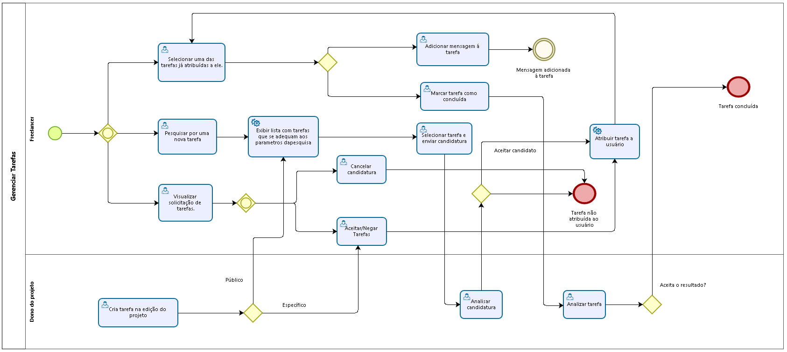

# 3.3.5 Processo 5 - Gerenciar perfil

### Este processo é responsável por lidar com quaisquer alterações no perfil do usuário, como foto de perfil, nome, senha, habilidades, experiências profissionais, etc... 

<!-- > **Autor:** Luís Brescia -->

#

## Detalhamento das atividades

> Obs: algumas sugestões abaixo, processo ainda não foi discutido com o grupo.

### **Pesquisar por uma nova tarefa**

    Usuário insere parametros de busca como preço oferecido e habilidades requisistadas, e é carregada para ele uma lista de tarefas que se encaixam nos parâmetros de busca, tarefas essas que em sua atribuição, foi selecionado a opção "abrir para o público" pelo dono do projeto.

    Nesta lista, para cada item tarefa será exibido nome da tarefa, preço oferecido, e habilidades requisitadas.

### **Candidatar-se para uma tarefa**

    Ao usuário clicar em uma tarefa a qual se interessou, é exibido um modal com mais informações sobre ela, como descrição detalhada, dono do projeto e prazo para entrega, além de um botão "candidatar-se", junto com um campo para o usuário inserir uma mensagem para o dono do projeto.

    Ao clicar em "candidatar-se", tarefa é redirecionada para a seção "candidaturas pendentes", na própria tela de tarefas.

### **Visualizar Solicitação de tarefas**

    Nesta aba o usuário tem a opção de cancelar candidatura para uma tarefa