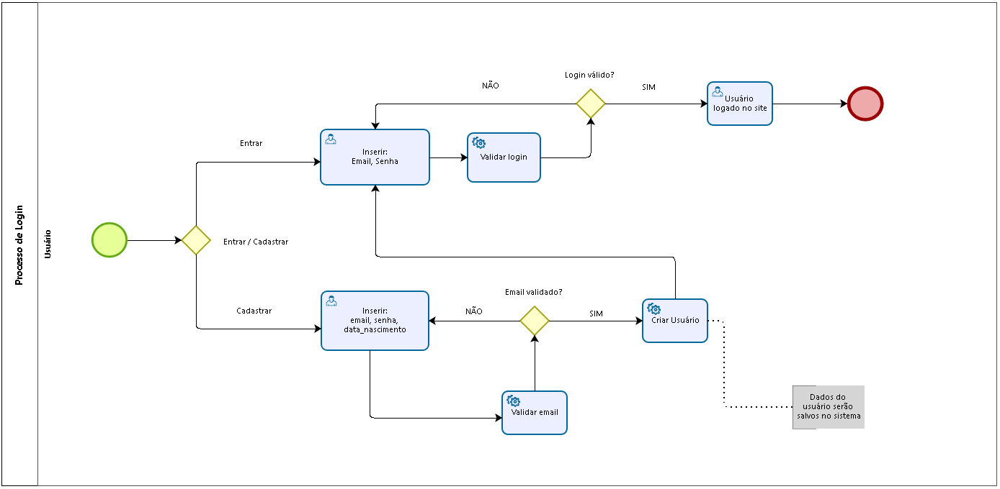

# 3.3.1 Processo 1 – Gerenciar login

### Este processo é responsável pelo login ao site, permitindo o usuário entrar com uma conta já cadastrada ou criar uma nova.

<!-- > **Autor:** Gustavo Pereira -->

#

## Detalhamento das atividades

### **Inserir: Email, senha, data_nascimento**

    O usuário insere seu email, senha, data de nascimento, e clica no botão cadastrar.
    
### **Criar usuário:**

O sistema cadastra o usuário e o redireciona para a tela de login..

### **Validar email**

    O sistema valida se o email inserido já está cadastrado no sistema, caso esteja, o sistema informa que o email já está cadastrado.

### **Inserir: Email, Senha:**

    O usuário insere seu email e senha, e clica no botão entrar.

### **Validar login:**

    Sistema valida o email e senha do usuário, caso estejam correto, o usuário é logado no site e 
    redirecionado para a tela principal, caso contrário, o sistema informa que o login está incorreto.

#

### **Tela login**

| **Comandos**         |  **Destino**                   |
| ---                  | ---                            |
| Entrar               | Entrar com uma conta já cadastrada            |
| Cadastrar            | Cadastrar | ---             |

#

### **Entrar com conta já cadastrada**

| **Campo**       | **Tipo**         | **Restrições**          |
| ---             | ---              | ---                     |
| email           | Caixa de Texto   | formato de e-mail       |
| senha           | Caixa de Texto   | mínimo de 8 caracteres  |

| **Comandos**         |  **Destino**                   |
| ---                  | ---                            | 
| Entrar               | Tela inicial            | 

#

### **Cadastrar**

| **Campo**       | **Tipo**         | **Restrições**          |
| ---             | ---              | ---                     |
| email          | Caixa de Texto   | formato de e-mail           |
| senha           | Caixa de Texto   | oculta                  |
| data de nascimento   | Data             | ---                     |

| **Comandos**         |  **Destino**                   | 
| ---                  | ---                            | 
| Cadastrar        | Tela de login     | 
