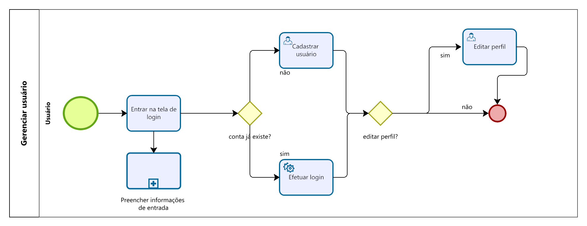

### 3.3.1 Processo 1 – Gerenciar usuário

Para realizar o cadastro, é necessário preencher os campos "nome", "CPF", "e-mail", "senha", "data de nascimento", "telefone" e "UF". Se todas as regras de criação de usuário forem atendidas, incluindo a garantia de que "CPF", "e-mail" e "telefone" sejam únicos, o usuário será criado com êxito. Além disso, os usuários já registrados podem fazer atualizações em suas informações de cadastro.

#### Detalhamento das atividades

**Acessar tela de login**

| **Campo**       | **Tipo**         | **Restrições**          | **Valor default** |
| ---             | ---              | ---                     | ---               |
| login           | Caixa de Texto   | formato de e-mail       | ---               |
| senha           | Caixa de Texto   | mínimo de 8 caracteres  | ---               |

| **Comandos**         |  **Destino**                   | **Tipo**        |
| ---                  | ---                            | ---             |
| entrar               | Fim do Processo 1              | default         |
| cadastrar            | Início do processo de cadastro | ---             |

**Cadastrar usuário**

| **Campo**       | **Tipo**         | **Restrições**          | **Valor default** |
| ---             | ---              | ---                     | ---               |
| nome            | Caixa de Texto   | ---                     | ---               |
| CPF             | Campo numérico   | apenas números          | ---               |
| senha           | Caixa de Texto   | oculta                  | ---               |
| e-mail          | Caixa de Texto   | deve possuir @          | ---               |
| data de nasc.   | Data             | ---                     | ---               |
| telefone        | Campo numérico   | xxxxx-xxxx              | ---               |
| UF              | Seleção única    | ---                     | UF                |
| ct ou freelancer| Seleção única    | ---                     | ---               |

| **Comandos**         |  **Destino**                   | **Tipo**        |
| ---                  | ---                            | ---             |
| criar usuário        | tela inicial da aplicação      | default         |
| cancelar             | tela de login                  | cancel          |

**Editar perfil**

| **Campo**       | **Tipo**         | **Restrições**          | **Valor default** |
| ---             | ---              | ---                     | ---               |
| senha           | Caixa de Texto   | oculta                  | ---               |
| e-mail          | Caixa de Texto   | deve possuir @          | ---               |
| telefone        | Campo numérico   | xxxxx-xxxx              | ---               |
| ct ou freelancer| Seleção única    | ---                     | UF                |

| **Comandos**         |  **Destino**                   | **Tipo**        |
| ---                  | ---                            | ---             |
| aceitar alterações   | tela inicial da aplicação      | default         |
| cancelar             | tela inicial da aplicação      | cancel          |
