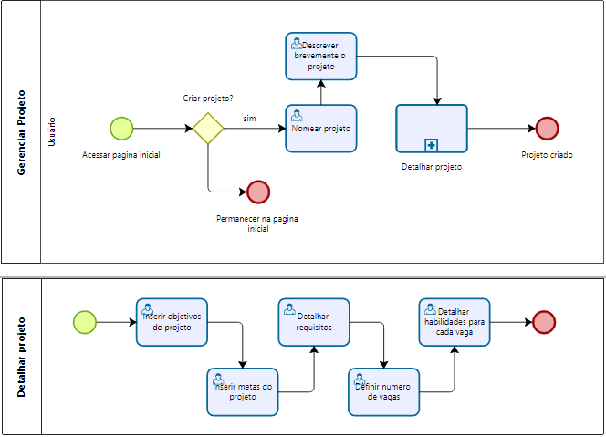

### 3.3.2 Processo 2 – Gerenciar projeto

O processo de gerenciamento de projeto começa com a criação de um projeto, no qual o usuário especifica o nome, a descrição e todos os detalhes relacionados ao projeto. Esta fase inicial é fundamental para estabelecer os objetivos e requisitos do projeto de forma clara e precisa.

#### Detalhamento das atividades

* **Nomear o projeto:**
    Após o usuário iniciar o processo de criação do projeto, é necessário adicionar um nome ao projeto.

* **Descrever brevemente o projeto:**
    Momento em que o usuário informa uma breve descrição do que se trata o projeto.

* **Detalhar o projeto:**
    Nesta subprocesso, o usuário adiciona todos os detalhes do projeto, objetivos, metas, requisitos, quantidade de vagas e as habilidades necessárias.

**Acessar pagina inicial**
| **Campo** | **Tipo** | **Restrições** | **Valor default** |
| --------- | -------- | -------------- | ----------------- |
| Projetos  | tabela   |                |                   |

| **Comandos**  | **Destino**  | **Tipo** |
| ------------- | ------------ | -------- |
| criar projeto | detalhamento | default  |

**Procurar projeto**

| **Campo** | **Tipo** | **Restrições** | **Valor default** |
| --------- | -------- | -------------- | ----------------- |
| Projetos  | tabela   |                |                   |

| **Comandos**      | **Destino**  | **Tipo** |
| ----------------- | ------------ | -------- |
| Clicar no projeto | Se inscrever |          |

**Detalhar projeto**

| **Campo** | **Tipo**       | **Restrições** | **Valor default** |
| --------- | -------------- | -------------- | ----------------- |
| nome      | caixa de texto |                |                   |
| detalhe   | caixa de texto |                |                   |
| objetivo  | caixa de texto |                |                   |
| vagas     | caixa de texto |                |                   |

**Abrir vagas parar freelancers**

| **Campo** | **Tipo** | **Restrições** | **Valor default** |
| --------- | -------- | -------------- | ----------------- |
| Projeto   |          |                |                   |

| **Comandos**   | **Destino**       | **Tipo** |
| -------------- | ----------------- | -------- |
| publicar vagas | avaliar candidato |          |

**Se inscrever para vaga**

| **Campo** | **Tipo** | **Restrições** | **Valor default** |
| --------- | -------- | -------------- | ----------------- |
| Projeto   |          |                |                   |

| **Comandos** | **Destino**      | **Tipo** |
| ------------ | ---------------- | -------- |
| inscrever-se | enviar currículo |          |

**Adicionar freelancer ao projeto**

| **Campo** | **Tipo** | **Restrições** | **Valor default** |
| --------- | -------- | -------------- | ----------------- |
| Projeto   |          |                |                   |

| **Comandos**         | **Destino**      | **Tipo** |
| -------------------- | ---------------- | -------- |
| contratar freelancer | fim da aplicação |          |
