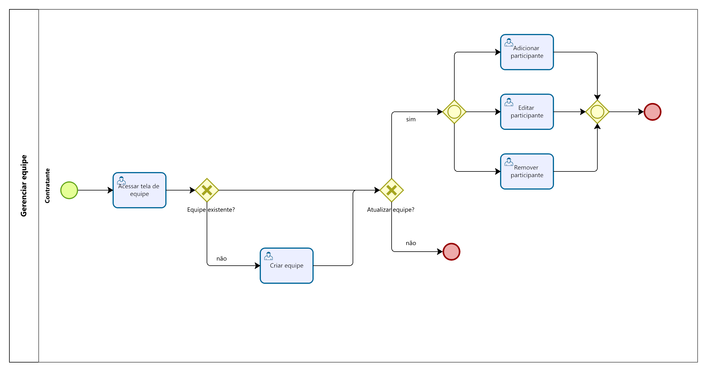

### 3.3.3 Processo 3 – Gerenciar equipe

A gerência de equipe abrange a criação, visualização e edição da equipe. Ao criar a equipe será necessário preencher os campos "título", "descrição" e "membros" (onde membros possuirão seus respectivos cargos). Após criada sua equipe, o usuário poderá gerenciar os membros da mesma.

#### Detalhamento das atividades

**Acessar tela de equipe**

| **Campo**       | **Tipo**         | **Restrições** | **Valor default** |
| ---             | ---              | ---            | ---               |
| título          | Caixa de Texto   |                |                   |
| descrição       | Caixa de Texto   |                |                   |
| membros         | Tabela           |                |                   |

| **Comandos**         |  **Destino**                   | **Tipo**          |
| ---                  | ---                            | ---               |
| editar               | início processo de editar      | edit              |

**Criar equipe**

| **Campo**       | **Tipo**         | **Restrições** | **Valor default** |
| ---             | ---              | ---            | ---               |
| título          | Caixa de Texto   |                |                   |
| descrição       | Caixa de Texto   |                |                   |
| membros         | Área de texto    |                |                   |
| cargos          | Seleção única    |                |                   |

| **Comandos**         |  **Destino**                   | **Tipo**          |
| ---                  | ---                            | ---               |
| criar                | fim processo criar             | default           |
| cancelar             | cancelar processo criar        | cancel            |

**Adicionar participante**

| **Campo**       | **Tipo**         | **Restrições** | **Valor default** |
| ---             | ---              | ---            | ---               |
| freelancer      | Caixa de Texto   |                |                   |
| cargo           | Seleção única    |                |                   |

| **Comandos**         |  **Destino**                   | **Tipo**          |
| ---                  | ---                            | ---               |
| adicionar            | fim processo adicionar         | default           |
| cancelar             | cancelar processo adicionar    | cancel            |

**Editar participante**

| **Campo**       | **Tipo**         | **Restrições** | **Valor default** |
| ---             | ---              | ---            | ---               |
| freelancer      | Caixa de Texto   |                |                   |
| cargo           | Seleção única    |                |                   |

| **Comandos**         |  **Destino**                   | **Tipo**          |
| ---                  | ---                            | ---               |
| editar               | fim processo editar            | default           |
| cancelar             | cancelar processo editar       | cancel            |

**Remover participante**

| **Campo**       | **Tipo**         | **Restrições** | **Valor default** |
| ---             | ---              | ---            | ---               |
| freelancer      | Caixa de Texto   |                |                   |
| cargo           | Seleção única    |                |                   |

| **Comandos**         |  **Destino**                   | **Tipo**          |
| ---                  | ---                            | ---               |
| remover              | fim processo remover           | default           |
| cancelar             | cancelar processo remover       | cancel            |