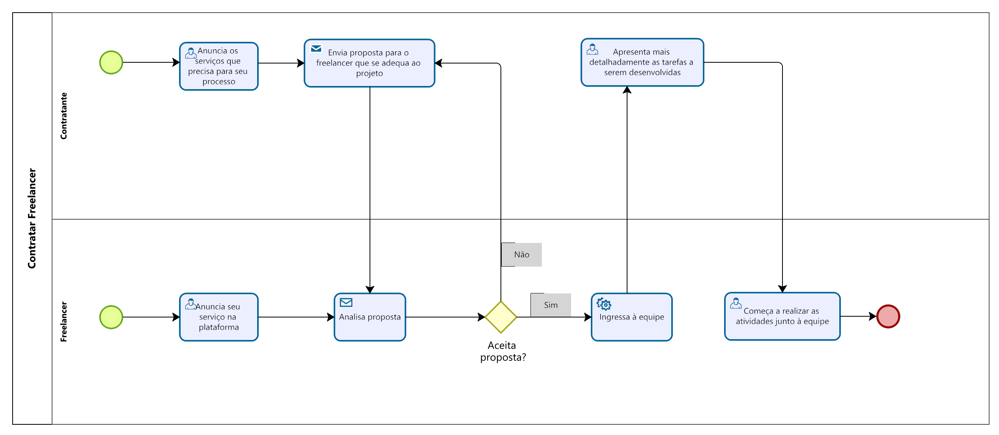

### 3.3.4 Processo 4 – Contratar Freelancer

#### Detalhamento das atividades

Para contratar um freelancer o contratante precisará anunciar o profissional que necessita em seu time e, em seguida verificar os prestadores de serviço já cadastrados na plataforma.
Em seguida, deverá enviar uma proposta ao freelancer que mais se adequa à vaga disponível, o qual deve analisar a proposta e aceitar ou não. 
Ao aceitar, será incluido à equipe e começará a desempenhar as suas funções.

Os tipos de dados a serem utilizados são:

* **Área de texto** - campo texto de múltiplas linhas
* **Caixa de texto** - campo texto de uma linha
* **Seleção única** - campo com várias opções de valores que são mutuamente exclusivos (tradicional radio button ou combobox)
* **Link** - campo que armazena uma URL

**Anunciar Vagas**

| **Campo**       | **Tipo**         | **Restrições** | **Valor default** |
| ---             | ---              | ---            | ---               |
| Nome do projeto | Caixa de Texto   |        ---     |         ---       |
| Nome do contratante | Caixa de texto   |     ---  |   ---  |
| Serviço a ser desenvolvido | Caixa de Texto   |     ---     |     ---   |

| **Comandos**         |  **Destino**                   | **Tipo**          |
| ---                  | ---                            | ---               |
| Perfil do projeto | Página com detalhamento do projeto  | ---   |
| Perfil do contratante | Página de perfil do contratante  | ---   |
| Mensagem | Enviar mensagem para o contratante  | ---   |

**Anunciar Serviço**

| **Campo**       | **Tipo**         | **Restrições** | **Valor default** |
| ---             | ---              | ---            | ---               |
| Nome do freelancer | Caixa de Texto   |        ---     |         ---       |
| Serviço ofertado | Caixa de Texto   |     ---     |     ---   |
| Serviço ofertado | Caixa de Texto   |     ---     |     ---   |

| **Comandos**         |  **Destino**                   | **Tipo**          |
| ---                  | ---                            | ---               |
| Perfil do freelancer | Página de perfil do freelancer  | ---   |
| Mensagem | Enviar mensagem para o freelancer  | ---   |

