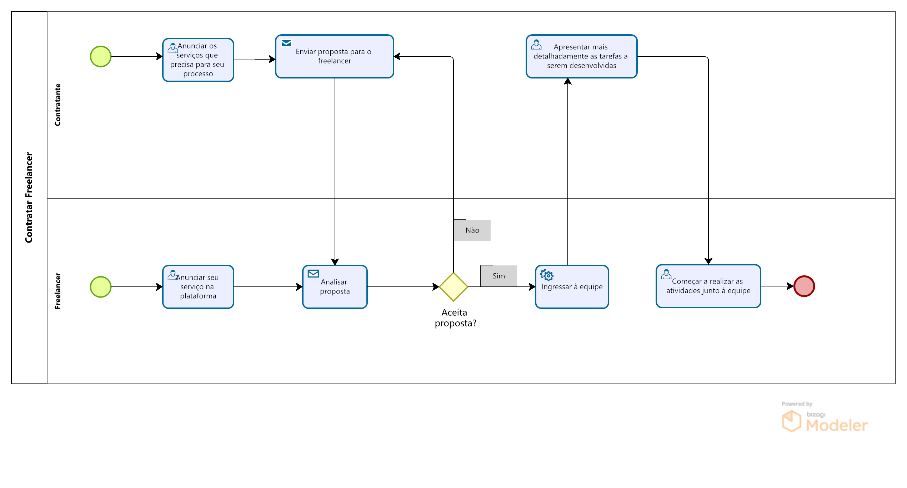

### 3.3.4 Processo 4 – Contratar Freelancer

#### Detalhamento das atividades

* **Anunciar os serviços que precisa para seu processo:**
    O contratante precisa registrar no sistema os serviçoes que necessita para executar o seu projeto.

* **Anunciar seu serviço na plataforma:**
    O freelancer precisa registrar no sistema o seu trabalho com seu portfólio profissional, para exibir os projetos que já trabalhou e mostrar sua experiência e estilo de trabalho.

* **Enviar proposta para o freelancer:**
    O contratante escolhe o freelancer que mais se adequa ao seu projeto e envia a sua proposta, que será analisada e respondida pelo profissional, sendo aceita ou não. O que possibilita uma contraproposta por parte do prestador de serviço.

* **Apresentar mais detalhadamente as tarefas a serem desenvolvidas:**
    Após a proposta aceita por ambas as partes, o contratante apresenta mais detalhes das tarefas que o freelancer terá que realizar e estipula prazos para entrega de resultados.

* **Começar a realizar as atividades junto à equipe:**
    Após o alinhamento dos detalhes entre contratante e freelancer, o serviço começa a ser realizado em conjunto com um time que pode ser, ou não, composto por mais freelancers responsáveis por outras atividades.

Os tipos de dados a serem utilizados são:

* **Área de texto** - campo texto de múltiplas linhas
* **Caixa de texto** - campo texto de uma linha
* **Seleção única** - campo com várias opções de valores que são mutuamente exclusivos (tradicional radio button ou combobox)
* **Link** - campo que armazena uma URL

#

### **Anunciar Vagas**

| **Campo**       | **Tipo**         | **Restrições** | **Valor default** |
| ---             | ---              | ---            | ---               |
| Nome do projeto | Caixa de Texto   |        ---     |         ---       |
| Nome do contratante | Caixa de texto   |     ---  |   ---  |
| Serviço a ser desenvolvido | Caixa de Texto   |     ---     |     ---   |

| **Comandos**         |  **Destino**                   | **Tipo**          |
| ---                  | ---                            | ---               |
| Perfil do projeto | Página com detalhamento do projeto  | ---   |
| Perfil do contratante | Página de perfil do contratante  | ---   |
| Mensagem | Enviar mensagem para o contratante  | ---   |

### **Anunciar Serviço**

| **Campo**       | **Tipo**         | **Restrições** | **Valor default** |
| ---             | ---              | ---            | ---               |
| Nome do freelancer | Caixa de Texto   |        ---     |         ---       |
| Serviço ofertado | Caixa de Texto   |     ---     |     ---   |
| Serviço ofertado | Caixa de Texto   |     ---     |     ---   |

| **Comandos**         |  **Destino**                   | **Tipo**          |
| ---                  | ---                            | ---               |
| Perfil do freelancer | Página de perfil do freelancer  | ---   |
| Mensagem | Enviar mensagem para o freelancer  | ---   |

