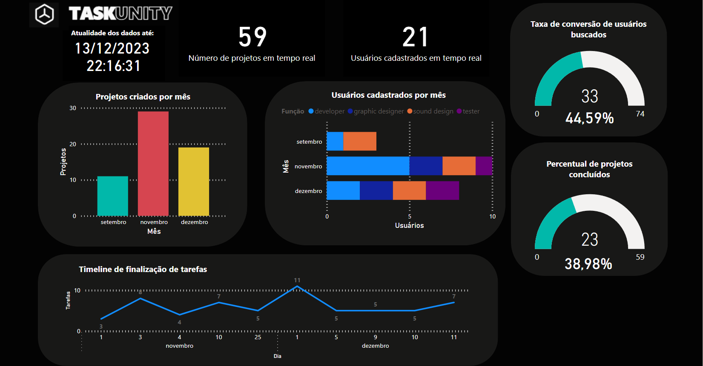

## 5. Indicadores de desempenho

A seguir está contemplado os indicadores utilizados no projeto TaskUnity.

Perspectivas de medidas de avaliação de desempenho de processos:

* Financeira
* Cliente
* Aprendizado e Crescimento
* Processos internos

| **Indicador** | **Objetivos** | **Descrição** | **Fonte dados** | **Perspectiva** |
| ---           | ---           | ---           | ---             | ---             |
| Taxa de projetos criados | Crescer o número de projetos cadastrados | Percentual de projetos criados mensalmente | Tabela projetos | Aprendizado e Crescimento |
| Taxa de usuários cadastrados | Crescer o número de usuários cadastrados | Percentual de usuários cadastrados mensalmente | Tabela de usuários | Aprendizado e Crescimento |
| Conversão de contratação de freelancers | Aumentar o número de freelancers contratados por busca | Percentual de freelancers contratados por busca feita por usuário | Tabela usuários e projetos | Processos internos |
| Percentual de projetos concluídos | Avaliar quantitativamente os projetos concluídos | Percentual de projetos concluídos por total de projetos | Tabela projetos | Clientes |
| Timeline de finalização de tasks | Avaliar quantas tasks estão sendo finalizadas no período de um mês | Mede com visão analítica de qual forma o usuário está utilizando a ferramenta de tasks | Tabela tasks | Clientes |

Segue imagem da dashboard analítica do TaskUnity, feita em PowerBI e povoada com dados diretamente do banco PostgreSQL.
