## 6. Interface do sistema

Visão geral da interação do usuário pelas telas do sistema. Apresente as principais interfaces da plataforma. 

## 6.1.1 Telas principal do sistema

Tela de boas vindas ao usuário, e também as iformações do site.

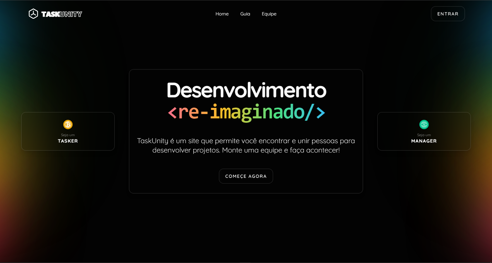

Cards da equipe, onde o usuário pode ver as informações dos integrantes do projeto.

## 6.2. Telas do processo Gerenciar Projeto

### 6.2.1 Acessar tela de projetos

Assim que o usuário acessar tela projetos, sera possível ver quais os projetos que pertence ao usuário e também a opção de criar um novo projeto.

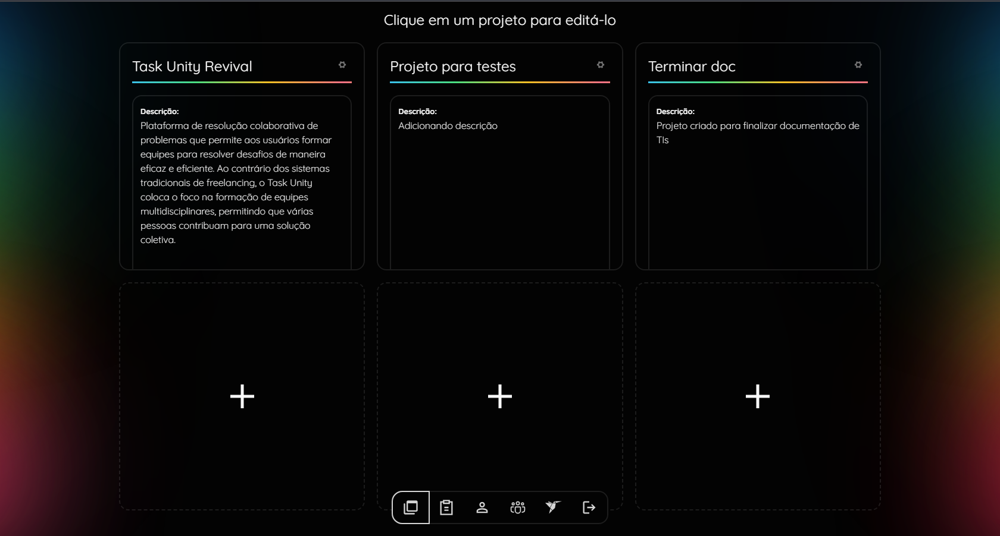

### 6.2.2 Acessar projeto

Se o usuário ja tiver algum projeto cadastro, será possível abrir o detalhamento do projeto, onde terá todas as informações referentes ao projeto.

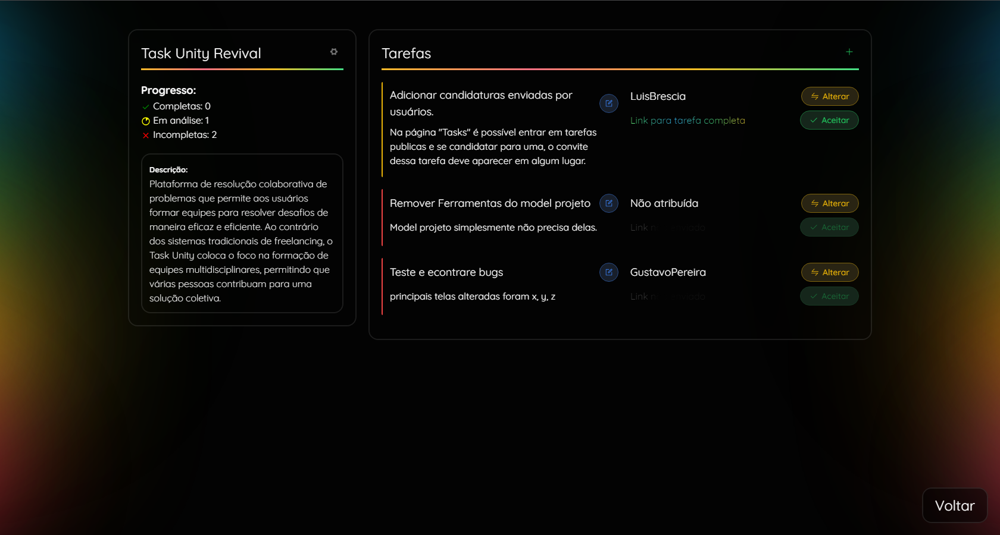

### 6.2.3 Criar novo projeto

se o usuário escolher criar um novo projeto, ele sera redirecionado para a tela de criação, onde ele informará todos os detalhes do projeto, como nome, descrição e as ferramentas que serão utilizadas.

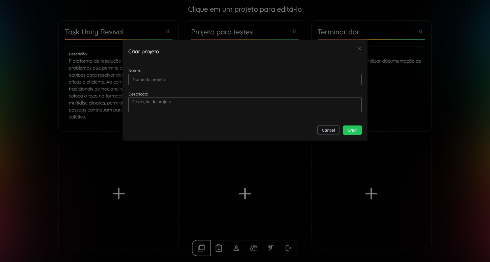

### 6.2.4 Excluir projeto

assim que o usuário abrir o detalhamento do projeto, ele tera uma opção de excluir o projeto.

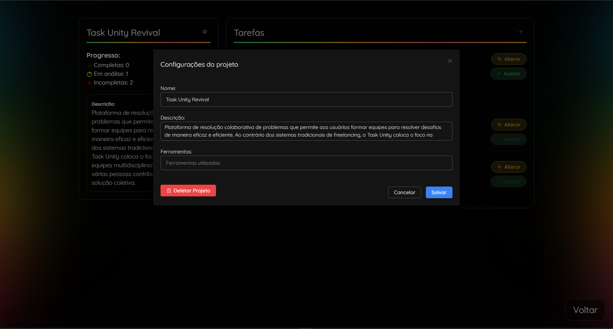

### 6.2.5 Editar projeto

assim que o usuário abrir o detalhamento do projeto, ele tera uma opção de editar as informações do projeto.

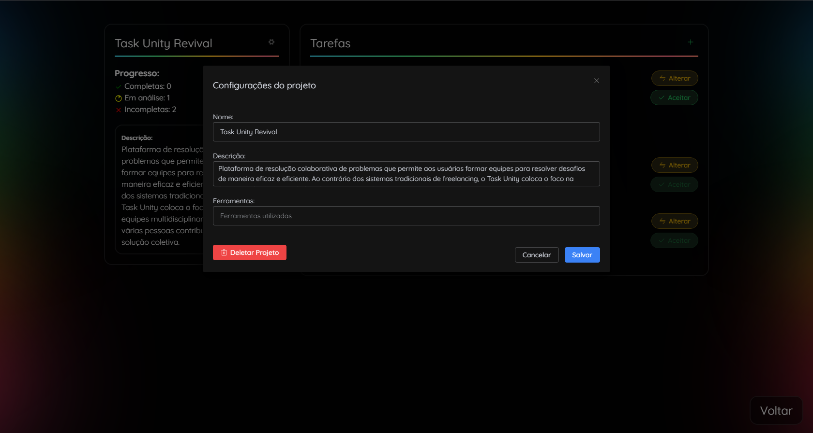

## 6.3. Telas do processo Gerenciar Login

### 6.3.1 Cadastrar uma nova conta

O usuário insere seu email, senha, data de nascimento, e clica no botão cadastrar.

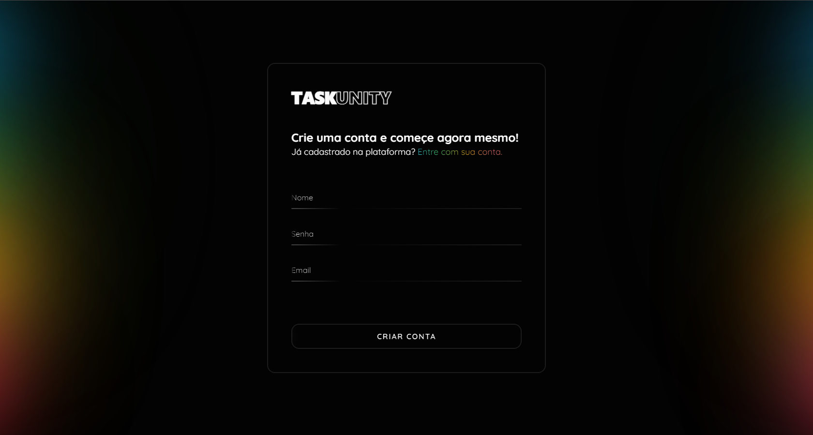

### 6.3.2 Entrar com uma conta já cadastrada

O usuário insere seu nome e senha, e clica no botão entrar.

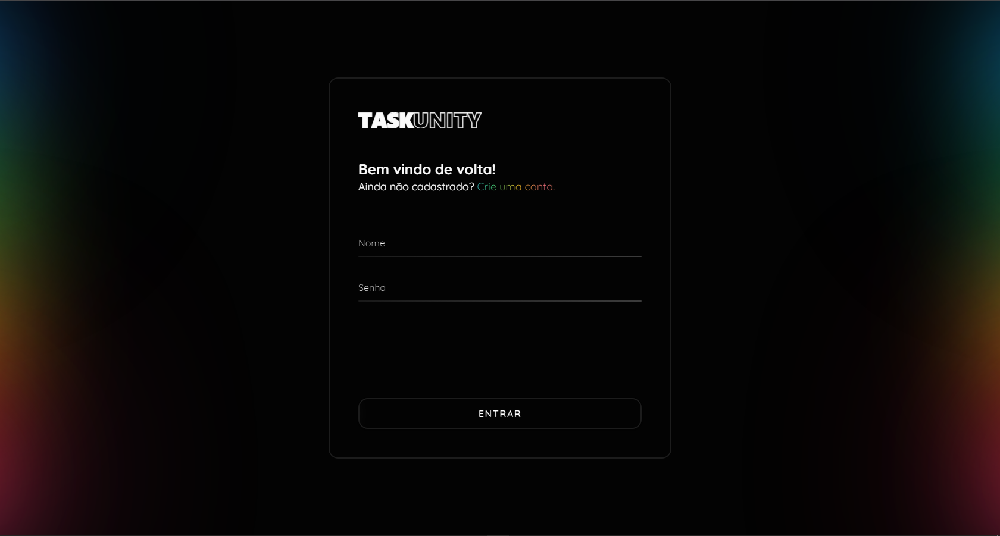

### 6.3.3 Editar usuário

O usuário pela tela de perfil, pode editar suas informações.

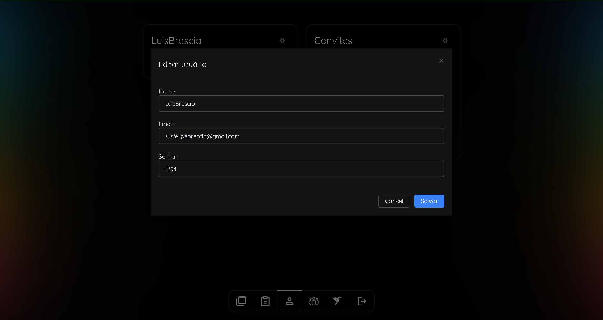

### 6.3.4 Notificação de exclusão de convite

O usuário recebe uma notificação de que seu convite foi excluido.

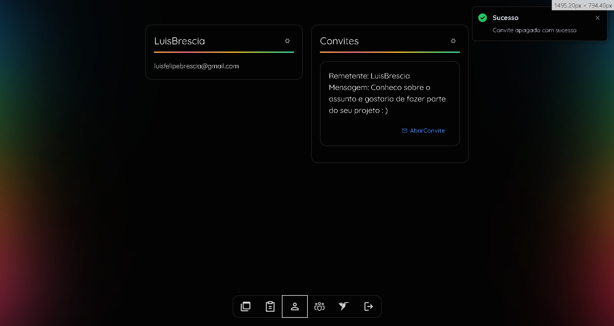

## 6.4. Telas do processo Gerenciar Tarefas

### 6.4.1 Editando uma tarefa

O usuário pela tela de tarefa, pode editar suas informações.

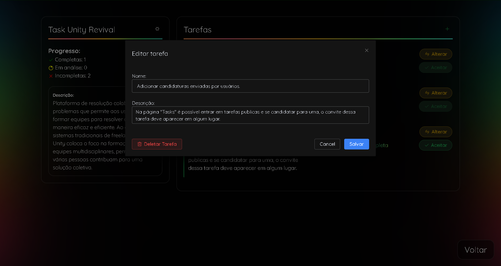

### 6.4.2 Atribuir tarefa a um usuário em específico.

O usuário pela tela de tarefa, pode atribuir a tarefa a um usuário em específico.

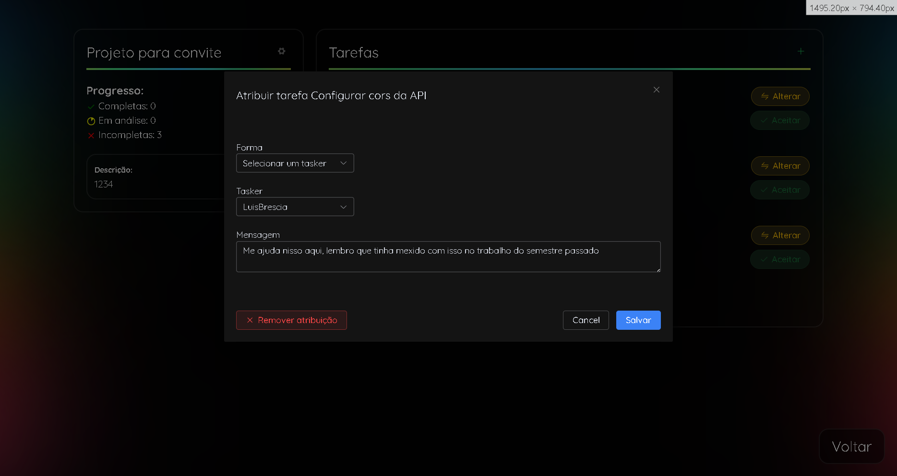

### 6.4.3 Acessando uma tarefa pela tela de tarefa

O usuário pela tela de tarefa, pode acessar a tarefa.

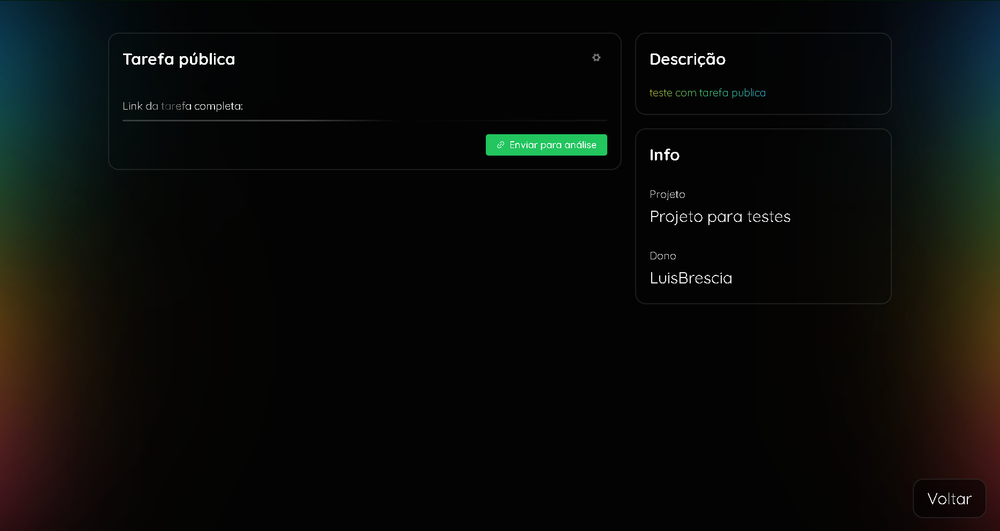

### 6.4.4 Sendo convidado para uma tarefa

O usuário recebe um convite para uma tarefa.

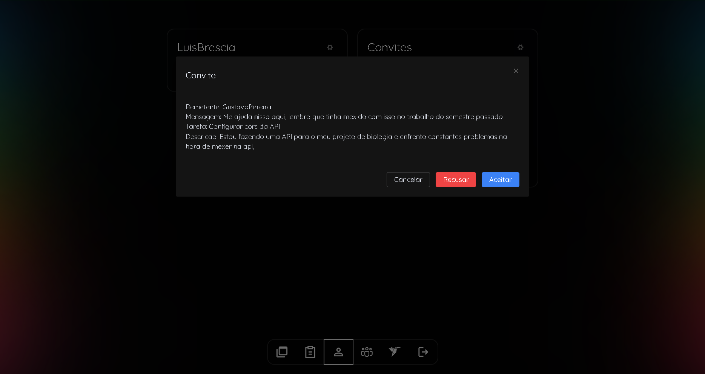

### 6.4.5 Tarefas do usuário

O usuário pode ver as tarefas que ele está participando.

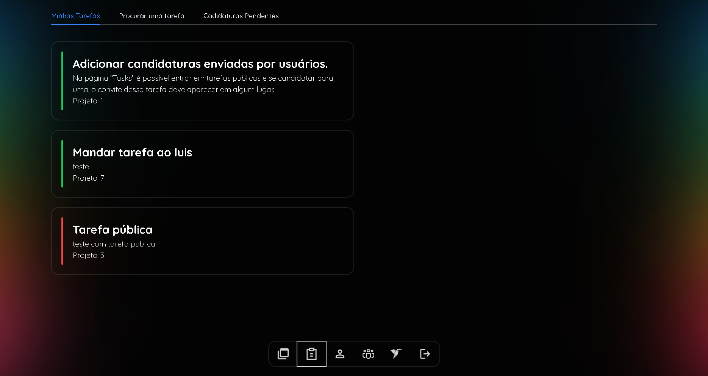

### 6.4.6 Tarefas enviar candidatura

O usuário pode enviar uma candidatura para uma tarefa pública.

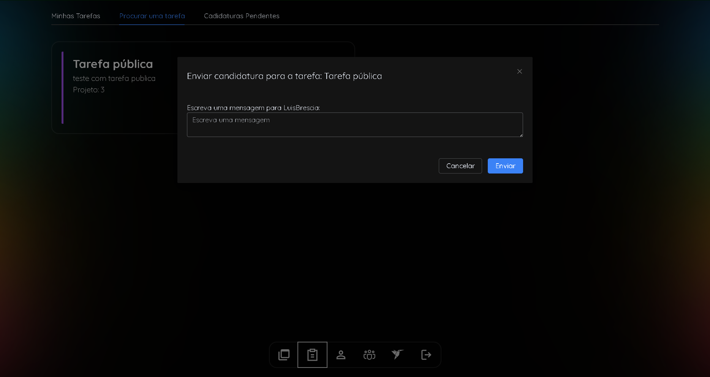

### 6.4.7 Tarefas candidatura pendente

O usuário pode ver as tarefas que ele está participando.

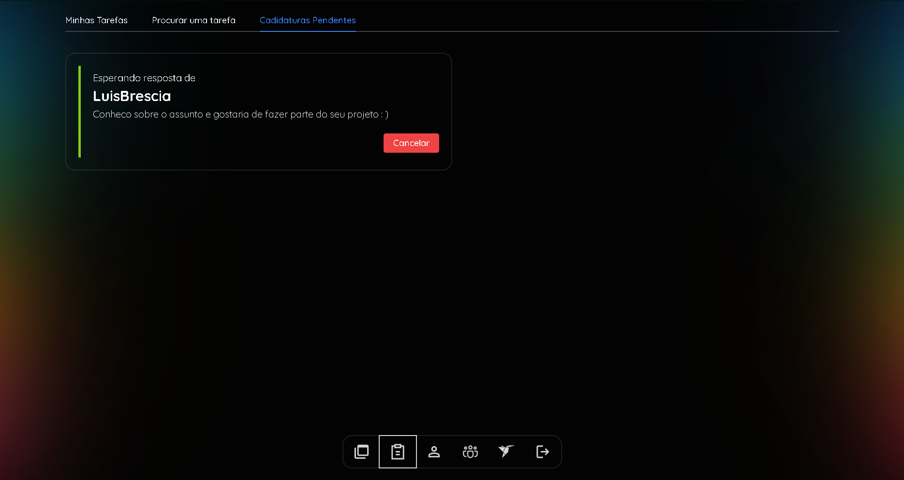